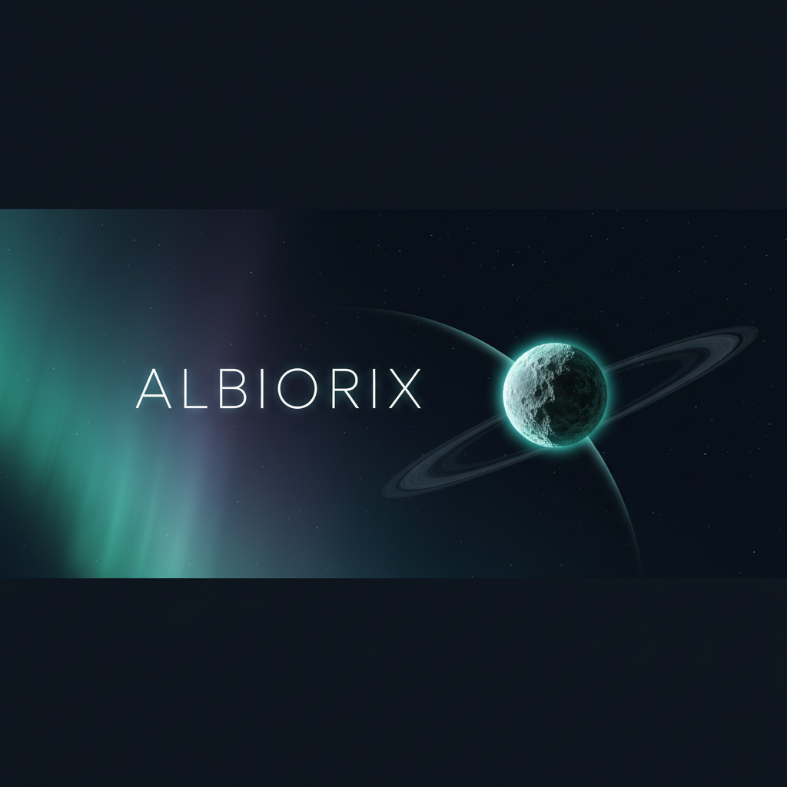
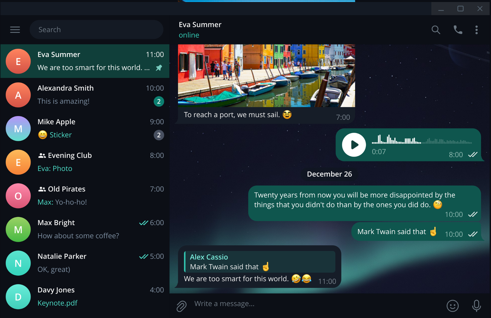
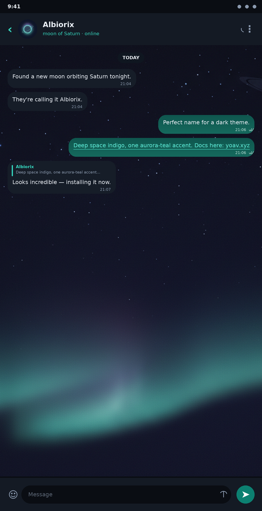
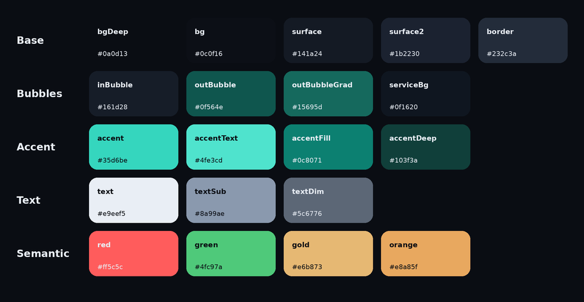

<div align="center">



# Albiorix

**A deep-space dark theme for Telegram — aurora teal on Saturnian indigo.**

Sleek · high-contrast · cohesive across **iOS · Android · Desktop**

### 📲 &nbsp;[**Add Albiorix to Telegram → t.me/addtheme/Albiorix**](https://t.me/addtheme/Albiorix)

**One tap — installs on iOS, Android & Desktop.**

[Manual install](#-install) · [Palette](#-palette) · [Build it yourself](#-build-it-yourself) · [yoav.xyz](https://yoav.xyz)

</div>

---

## ✦ About

**Albiorix** is an irregular moon of Saturn, named after a Gaulish war-god — *"king of the world."* The theme leans all the way into that: a cool, near-black **deep-space indigo** base (never pure black — easier on the eyes and lets surfaces layer), one confident **aurora-teal** accent, and a teal-tinted outgoing bubble. A subtle cosmic wallpaper — an aurora drifting under a hint of Saturn's rings — sits behind every chat.

Design principles:

- **One confident accent.** Bright teal (`#35d6be`) for links, icons, online status and outlines on dark surfaces; a deeper teal (`#0c8071`) for filled buttons so light text stays readable.
- **Real contrast.** Every text/background and button pairing meets **WCAG AA** (verified in the build — worst case 4.8:1).
- **Coherent everywhere.** Generated from a single master palette, so Desktop and mobile match. No stray default-blue leaking through.

## ✦ Preview



<sub>Albiorix on Telegram Desktop — the real thing.</sub>

| Mobile mock-up | Palette |
| :--: | :--: |
|  |  |

> The mobile mock-up is rendered directly from the real theme colors (`build/preview.py`) — what you see is what you get.

## ✦ Install

**Easiest — any platform:** open **[t.me/addtheme/Albiorix](https://t.me/addtheme/Albiorix)** in Telegram and tap to apply. One cloud theme, syncs across your devices, and updates automatically. The manual per-platform files below are for offline install or tweaking.

### Desktop (Windows · macOS · Linux)
1. Download **[`desktop/Albiorix.tdesktop-theme`](desktop/Albiorix.tdesktop-theme)**.
2. Open it from within Telegram Desktop (double-click, or drag it onto the window).
3. In the preview that appears, click **Apply This Theme** → **Keep Changes**.

### Android
1. Send **[`android/Albiorix.attheme`](android/Albiorix.attheme)** to your **Saved Messages**.
2. Tap the file → a theme preview opens → tap **Apply**. *(The cosmic wallpaper is bundled inside the file.)*

### iOS
iOS installs themes from a cloud link, not a file (there's no hand-editable iOS theme-file format). So on iPhone/iPad just open **[t.me/addtheme/Albiorix](https://t.me/addtheme/Albiorix)** and tap to apply. To build it natively in the in-app editor instead, see **[`ios/README.md`](ios/README.md)** for the color recipe.

## ✦ The cloud link

**[t.me/addtheme/Albiorix](https://t.me/addtheme/Albiorix)** is live — one link that installs on iOS, Android and Desktop, syncs across your devices, and auto-updates whenever the theme is edited.

Want to fork it under your own slug, attach pixel-perfect per-platform variants, or change the wallpaper? **[docs/PUBLISH.md](docs/PUBLISH.md)** covers the in-app and web-editor routes, shortname rules, and the iOS color recipe in full.

## ✦ Palette

`#` values are the single source of truth ([`palette.json`](palette.json), authored in [`build/palette.py`](build/palette.py)).

| Role | Token | Hex | | Role | Token | Hex |
|---|---|---|---|---|---|---|
| App background | `bg` | `#0c0f16` | | Accent (links/icons) | `accent` | `#35d6be` |
| Deepest base | `bgDeep` | `#0a0d13` | | Accent (in-bubble link) | `accentText` | `#4fe3cd` |
| Elevated surface | `surface` | `#141a24` | | Accent fill (buttons) | `accentFill` | `#0c8071` |
| Menus / sheets | `surface2` | `#1b2230` | | Selected chat | `accentDeep` | `#103f3a` |
| Hairlines | `border` | `#232c3a` | | Primary text | `text` | `#e9eef5` |
| Incoming bubble | `inBubble` | `#161d28` | | Secondary text | `textSub` | `#8a99ae` |
| Outgoing bubble | `outBubble` | `#0f564e` | | Disabled / hints | `textDim` | `#5c6776` |
| Outgoing gradient | `outBubbleGrad` | `#15695d` | | Saturn-ring gold | `gold` | `#e6b873` |

## ✦ What's inside

```
Albiorix/
├── desktop/
│   ├── Albiorix.tdesktop-theme   ← install this (zip: palette + wallpaper)
│   └── colors.tdesktop-theme     ← the readable Desktop palette (467 keys)
├── android/
│   └── Albiorix.attheme          ← install this (769 keys + embedded wallpaper)
├── ios/
│   └── README.md                 ← install via the cloud link + in-app recipe
├── assets/
│   ├── wallpaper.png / .jpg      ← cosmic chat background
│   ├── cover.png · icon.png      ← branding
│   └── preview.png · palette.png ← rendered from the real colors
├── build/
│   ├── palette.py                ← master palette (edit colors here)
│   ├── build.py                  ← palette → desktop + android files
│   ├── preview.py                ← palette → preview images
│   └── base/                     ← vendored Telegram base inputs (reproducible build)
├── docs/PUBLISH.md               ← full t.me/addtheme publishing guide
└── palette.json                  ← machine-readable palette
```

## ✦ Build it yourself

Everything regenerates from `build/palette.py`. Requires Python 3 + Pillow (`pip install pillow`) and `zip`.

```bash
python3 build/build.py      # → desktop/* , android/* , assets/wallpaper.jpg , palette.json
python3 build/preview.py    # → assets/preview.png , assets/palette.png
```

Change a color in `build/palette.py`, re-run, done — Desktop and Android stay in sync, and the build prints a WCAG contrast report so you don't ship an unreadable pairing.

**How it works:** the Desktop theme recolors Telegram's official *night* base palette (so all ~470 keys stay present); the Android theme transforms Telegram's default color table light→dark (neutral inversion + blue→teal) and then layers precise brand overrides, covering all ~770 keys so no screen is left light.

## ✦ Credits & license

Design, artwork and tooling by **[Yoav](https://yoav.xyz)**.

Build tooling and original artwork are released under the **MIT License** ([LICENSE](LICENSE)). The generated palettes derive from Telegram's open-source theme resources; *Telegram* is a trademark of Telegram FZ-LLC. This is an unofficial, community theme, provided as-is.
